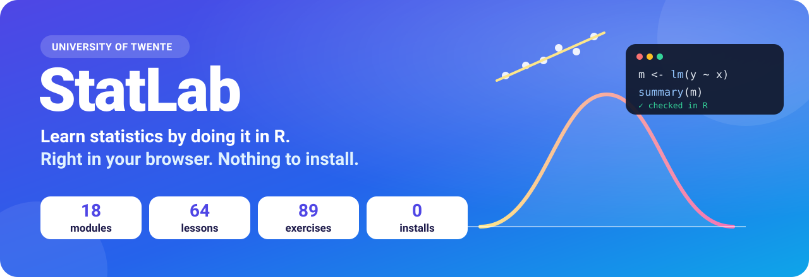
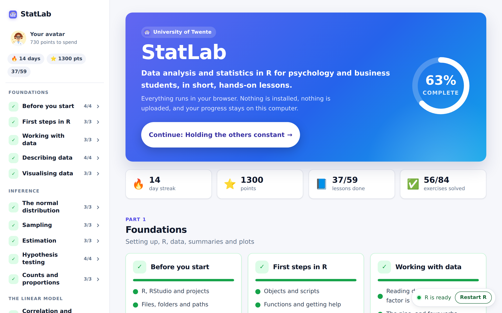
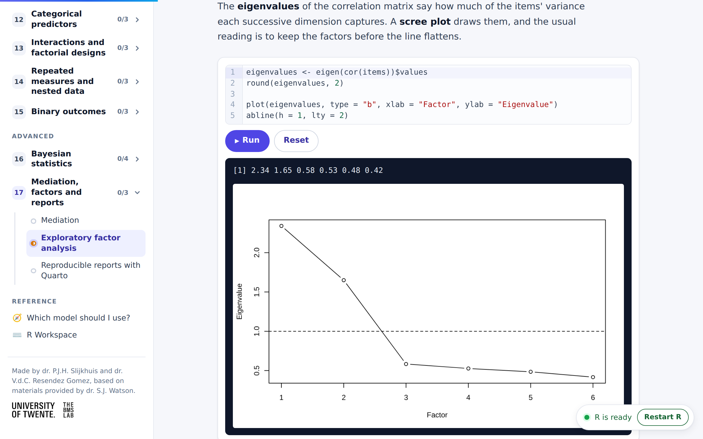
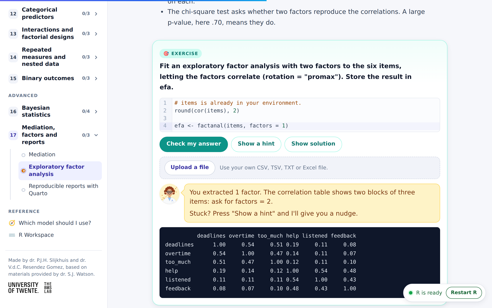
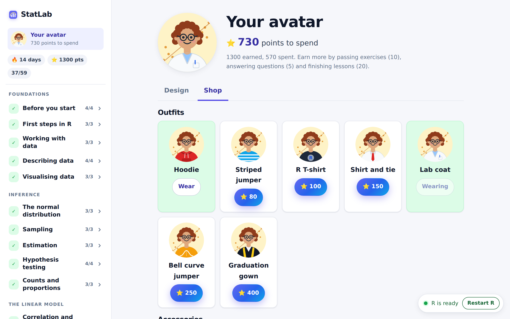
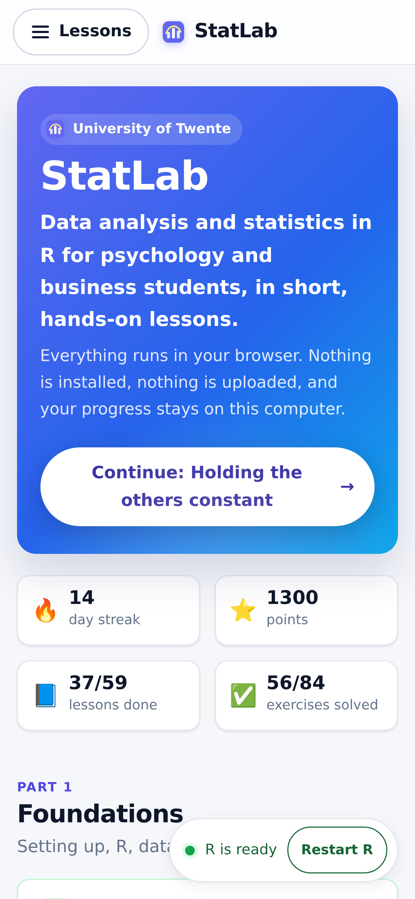

  

  
  

  
  
  
  

<h3 align="center">Statistics you learn by running it, not by reading about it.</h3>

  StatLab is a complete R and statistics course that runs <strong>entirely in the browser</strong>. 
  Students read, predict, write real R, and get instant feedback, from their first <code>read.csv</code> to mixed models and Bayes. 
  No installation. No account. No server. No data ever leaves the student's computer.

  Built for psychology and business students at the <strong>University of Twente</strong>. 
  Made by dr. P.J.H. Slijkhuis and dr. V.d.C. Resendez Gomez, based on materials provided by dr. S.J. Watson.

## See it in action

  

## Why students love it

<table>
  <tr>
    <td width="33%" valign="top">
      <h3>⚡ Real R, zero setup</h3>
      The full R language, compiled to WebAssembly with <a href="https://docs.r-wasm.org/webr/latest/">webR</a>, runs in the page. Open a link on any laptop or Chromebook and start coding in seconds.
    </td>
    <td width="33%" valign="top">
      <h3>✅ Answers checked by R</h3>
      84 exercises are marked by R itself. A wrong answer gets feedback on the <em>specific</em> mistake, not just a red cross.
    </td>
    <td width="33%" valign="top">
      <h3>🧑‍🔬 An avatar that coaches</h3>
      Students design their own avatar, which explains their mistakes and R's error messages in plain language.
    </td>
  </tr>
  <tr>
    <td valign="top">
      <h3>🎮 Points, streaks, rewards</h3>
      Every solved exercise and finished lesson earns points to spend in the avatar shop. Daily streaks keep students coming back.
    </td>
    <td valign="top">
      <h3>📈 Six live simulations</h3>
      Drag a regression line, draw a thousand samples, watch p-values move. The hardest ideas in the course become something you can play with.
    </td>
    <td valign="top">
      <h3>🧭 "Which model should I use?"</h3>
      A guide that walks from a research question to the right model among 44, with ready-to-run R code and a link to the lesson.
    </td>
  </tr>
  <tr>
    <td valign="top">
      <h3>🖥️ A workspace like RStudio</h3>
      Script tabs, console, environment and files panes, <kbd>Tab</kbd> completion, and most of CRAN one <code>install.packages()</code> away.
    </td>
    <td valign="top">
      <h3>📂 Your own data</h3>
      Upload a CSV or Excel file and analyse it right next to the lesson. It stays in the browser and is never uploaded anywhere.
    </td>
    <td valign="top">
      <h3>📱 Works on a phone</h3>
      The layout folds down for small screens, and progress can be exported and picked up on another device.
    </td>
  </tr>
</table>

## A look inside

<table>
  <tr>
    <td width="50%"></td>
    <td width="50%"></td>
  </tr>
  <tr>
    <td align="center">Your progress, streak and points at a glance.</td>
    <td align="center">Every code block is real R: edit it, run it, see the plot.</td>
  </tr>
  <tr>
    <td width="50%"></td>
    <td width="50%"></td>
  </tr>
  <tr>
    <td align="center">A mistake? The avatar explains what went wrong.</td>
    <td align="center">Points buy outfits, accessories and backgrounds.</td>
  </tr>
  <tr>
    <td width="50%"></td>
    <td width="50%"></td>
  </tr>
  <tr>
    <td align="center">The R Workspace: RStudio's panes, with your own data.</td>
    <td align="center">From research question to model in a few clicks.</td>
  </tr>
  <tr>
    <td width="50%"></td>
    <td width="50%"></td>
  </tr>
  <tr>
    <td align="center">Drag the line and watch the squared residuals shrink.</td>
    <td align="center">Skewed data, and means that still come out normal.</td>
  </tr>
  <tr>
    <td width="50%"></td>
    <td width="50%"></td>
  </tr>
  <tr>
    <td align="center">What "95% confidence" means across a hundred samples.</td>
    <td align="center">A p-value, drawn from four thousand studies.</td>
  </tr>
</table>

### In your pocket too

On a phone the sidebar folds into a **Lessons** button and the streak, points and
progress tiles stack into a grid. Progress, streaks, points and the avatar all
live in the browser, and export to a file that imports on any other computer.

 

## The course

**18 modules · 59 lessons · 84 checked exercises · 6 interactive simulations.**
From "what is a file path?" to mixed models, logistic regression, mediation and
Bayes. Statistics is taught the way the course team's own R workshops teach it:
in tidyverse style and through the linear model. `lm`, `lmer` and `glm` do the
work, and the t-test, ANOVA and chi-square appear as those same models under
their traditional names.

| | Module | What it covers | Simulation |
|---|---|---|---|
| **Foundations** | | | |
| 0 | Before you start | RStudio Projects, files, folders and paths, and what R's symbols mean, with a cheat sheet | |
| 1 | First steps in R | Objects, functions, help, packages and `library()` | |
| 2 | Working with data | `read.csv`, factors, the pipe, `select`, `filter`, `mutate`, wide and long data | |
| 3 | Describing data | `group_by` and `summarise`, mean versus median, surprises in a summary, scale scores and Cronbach's alpha | |
| 4 | Visualising data | ggplot2 as layers, facets, and an APA-ready figure | |
| **Inference** | | | |
| 5 | The normal distribution | Density, z-scores and probabilities | Distribution |
| 6 | Sampling | Sampling error, sampling distributions, the Central Limit Theorem | Central Limit Theorem |
| 7 | Estimation | Standard errors, confidence intervals, SD, SE and CI error bars | Confidence intervals |
| 8 | Hypothesis testing | Null distributions, p-values, Type I and II errors, power, effect sizes and sample-size planning | p-values and power |
| 9 | Counts and proportions | One proportion, contingency tables, the chi-square test, Cramér's V, Fisher's exact test | |
| **The linear model** | | | |
| 10 | Correlation and simple regression | `lm(y ~ x)`, reading model output with `tidy()` and `glance()` | Correlation, least squares |
| 11 | Multiple regression | Several predictors, each slope holding the others constant, reporting R² and F, checking residuals and influential cases | |
| 12 | Categorical predictors | The t-test as `lm`, dummy coding, `emmeans` pairwise comparisons | |
| 13 | Interactions and factorial designs | `a * b`, sum-to-zero contrasts, Type III tests with `car`, interaction plots | |
| 14 | Repeated measures and nested data | `lmer` with `(1 \| id)`, fixed and random effects, the paired t-test | |
| 15 | Binary outcomes | `glm(..., family = binomial)`, log odds, odds ratios and reporting | |
| **Advanced** | | | |
| 16 | Bayesian statistics | Prior, likelihood and posterior, credible intervals, Bayes factors, Bayesian regression | |
| 17 | Mediation, factors and reports | Indirect effects with bootstrap intervals, exploratory factor analysis, reproducible reports with Quarto | |

### How a lesson works

Every lesson is built from the same few blocks, so learning is active from the
first line:

- 🤔 **Predict**: commit to an answer *before* the code or simulation settles it.
- ▶️ **CodeBlock**: an editable R editor with console output, warnings, errors and plots.
- 🎯 **Exercise**: a task whose answer R checks, with hints and a solution.
- ❓ **Quiz**: a conceptual question with an explanation for every choice.
- 📝 **Interpret**: pick the right reading of the output and the right APA-style sentence.
- 🎛️ **Simulation**: one of the six interactive simulations.

Two fictional, generated datasets carry the course: a population of 5000
students (`wellbeing-population.csv`) for the sampling modules, and a workplace
study of 480 employees (`workplace.csv`) built so that every model in the
linear-model part has a real effect to find.

## Built to be trusted

- **Every exercise is tested against real R.** On every change, CI runs each
  solution, alternate solution and known wrong answer through R and checks that
  the right ones pass and the wrong ones fail for the right reason.
- **A real browser clicks through the site** before anything is published.
- **It keeps itself up to date.** A weekly workflow checks for new versions of
  webR and the site's dependencies and only takes them after the full R check
  passes.
- **Private by design.** A static site with no backend, no accounts and no
  tracking. Uploaded data and progress never leave the student's browser.

## Credits

StatLab was made by **dr. P.J.H. Slijkhuis** and **dr. V.d.C. Resendez Gomez**,
based on materials provided by **dr. S.J. Watson**.

  
  &nbsp;&nbsp;&nbsp;
  

It is a project of the [University of Twente](https://www.utwente.nl/en/) and
[The BMS Lab](https://bmslab.utwente.nl/). The same credit shows at the foot of
the sidebar on every page of the site and at the bottom of the home page. The
partner logos are in `src/assets/logos/`, picked up by file name;
see the README there to replace one.

  

